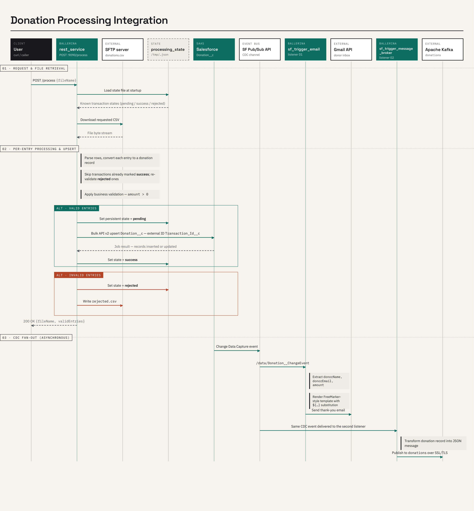

# Restos POC - Donation Processing Integration

A Ballerina workspace with three integrations that process donation data end-to-end: ingest CSV files, upsert to Salesforce, send email notifications, and publish events to Kafka.

## Architecture



## Use Cases

### Use Case 1: Batch Donation Ingestion (rest_service)

An organization receives donation records as CSV files uploaded to an SFTP server. The `rest_service` provides a REST endpoint to trigger processing of these files. It downloads the CSV, validates each entry, rejects invalid records, and upserts the valid ones into Salesforce as `Donation__c` records using the Bulk API v2. This enables bulk ingestion of donations without manual Salesforce data entry.

### Use Case 2: Real-Time Email Notifications (sf_trigger_email)

When a donation record is created or updated in Salesforce (either via the bulk ingestion above or through any other means), a CDC (Change Data Capture) event fires. The `sf_trigger_email` service listens for these events and automatically sends a personalized thank-you email to the donor using the Gmail API.

### Use Case 3: Event Streaming to Kafka (sf_trigger_message_broker)

The same CDC events are also consumed by `sf_trigger_message_broker`, which publishes the full donation record as a JSON message to an Apache Kafka `donations` topic over SSL/TLS. This enables downstream systems (analytics, reporting, audit logging, etc.) to consume donation events asynchronously.

## CSV File Format

The input CSV file must have the following columns:

| Column | Type | Description | Example |
|--------|------|-------------|---------|
| `transactionId` | string | Unique identifier for the donation transaction | `TXN-5001` |
| `donorId` | string | Unique identifier for the donor | `DON-5001` |
| `donorName` | string | Full name of the donor | `Emily Carter` |
| `donorEmail` | string | Email address of the donor | `emily.carter@example.com` |
| `amount` | decimal | Donation amount (must be positive) | `120.00` |
| `paymentMode` | string | Payment method used | `CARD`, `BANK_TRANSFER`, `CHEQUE`, `CASH` |
| `donationDate` | string | Date of donation in DD/MM/YYYY format | `10/09/2026` |

**Example CSV:**
```csv
transactionId,donorId,donorName,donorEmail,amount,paymentMode,donationDate
TXN-10001,DON-5001,Emily Carter,emily.carter@example.com,120.00,CARD,10/09/2026
TXN-10002,DON-5002,James Whitfield,james.whitfield@example.com,45.50,BANK_TRANSFER,11/09/2026
TXN-9003,DON-5003,Olivia Bennett,olivia.bennett@example.com,300.00,CHEQUE,12/09/2026
```

### CSV to Salesforce Field Mapping

| CSV Column | Salesforce Field | Transformation |
|------------|------------------|----------------|
| `transactionId` | `Transaction_Id__c` | Direct mapping (used as external ID for upsert) |
| `donorId` | `Donor_Id__c` | Direct mapping |
| `donorName` | `Donor_Name__c` | Direct mapping |
| `donorEmail` | `Donor_Email__c` | Direct mapping |
| `amount` | `Amount__c` | Direct mapping |
| `paymentMode` | `Payment_Mode__c` | Direct mapping |
| `donationDate` | `Donation_Date__c` | Date format converted from `DD/MM/YYYY` to `YYYY-MM-DD` |

## Validation Rules

Entries are validated before being sent to Salesforce:

- **Amount must be positive** - Entries with negative amounts are rejected
- Rejected entries are written to a `rejected.csv` file on the SFTP server containing their transaction IDs

## Idempotency

A local JSON state file (`/tmp/processing_state.json`) tracks every transaction by its `transactionId` with one of three states:

| State | Meaning |
|-------|---------|
| `pending` | Validated but not yet confirmed in Salesforce |
| `success` | Successfully upserted to Salesforce |
| `rejected` | Failed validation (e.g., negative amount) |

On each run, the service:
1. Loads the state file at startup
2. **Skips** any transaction already marked `success` — prevents duplicate Salesforce upserts
3. **Re-validates** rejected entries (in case the CSV was corrected)
4. Persists updated state after processing

This means calling `POST /process` with the same CSV file multiple times is safe — already-processed donations will not be duplicated in Salesforce.

**To re-process all entries from scratch**, delete the state file:
```bash
rm /tmp/processing_state.json
```

## Prerequisites

- [Ballerina Swan Lake](https://ballerina.io/downloads/) (2201.13.5 or later)
- Salesforce Developer Org with:
  - `Donation__c` custom object with the fields listed above
  - Change Data Capture enabled for `Donation__c`
  - Connected App with OAuth2 credentials
- Gmail API OAuth2 credentials (for email notifications)
- SFTP server access (for CSV file hosting)
- Aiven Kafka cluster with SSL certificates (for message broker)

## Packages

### 1. rest_service

REST API that reads a donation CSV from SFTP, validates entries, and upserts valid records to Salesforce.

**Endpoint:**
```
POST http://localhost:9090/process
Content-Type: application/json

{
  "fileName": "donations.csv"
}
```

**Response:**
```json
{
  "fileName": "donations.csv",
  "validEntries": [
    {
      "transactionId": "TXN-5001",
      "donorId": "DON-5001",
      "donorName": "Emily Carter",
      "donorEmail": "emily.carter@example.com",
      "amount": 120.00,
      "paymentMode": "CARD",
      "donationDate": "10/09/2026"
    }
  ]
}
```

**Config (`rest_service/Config.toml`):**
```toml
ftpHost = "<sftp-host>"
ftpPort = 22
ftpUsername = "<username>"
ftpPassword = "<password>"
protocol = "sftp"

clientId = "<salesforce-client-id>"
clientSecret = "<salesforce-client-secret>"
refreshToken = "<salesforce-refresh-token>"
refreshUrl = "https://login.salesforce.com/services/oauth2/token"
sfBaseUrl = "https://<your-org>.my.salesforce.com"
```

### 2. sf_trigger_email

Listens to Salesforce CDC events on `Donation__c` and sends a thank-you email to the donor via Gmail.

**What it does:**
1. Subscribes to `/data/Donation__ChangeEvent` via Salesforce Pub/Sub API
2. Converts the CDC payload to a `SalesforceDonation` record using `cloneWithType`
3. Sends a thank-you email to the donor via the Google Gmail API

**Config (`sf_trigger_email/Config.toml`):**
```toml
instanceUrl = "https://<your-org>.my.salesforce.com"
tenantId = "<salesforce-org-id>"
clientId = "<salesforce-client-id>"
clientSecret = "<salesforce-client-secret>"
refreshToken = "<salesforce-refresh-token>"
refreshUrl = "https://login.salesforce.com/services/oauth2/token"

gmailClientId = "<google-client-id>"
gmailClientSecret = "<google-client-secret>"
gmailRefreshToken = "<google-refresh-token>"
```

### 3. sf_trigger_message_broker

Listens to the same Salesforce CDC events and publishes donation records to a Kafka topic.

**What it does:**
1. Subscribes to `/data/Donation__ChangeEvent` via Salesforce Pub/Sub API
2. Extracts donation data from the CDC event
3. Publishes the record as JSON to the `donations` Kafka topic over SSL/TLS

**Config (`sf_trigger_message_broker/Config.toml`):**
```toml
instanceUrl = "https://<your-org>.my.salesforce.com"
tenantId = "<salesforce-org-id>"
clientId = "<salesforce-client-id>"
clientSecret = "<salesforce-client-secret>"
refreshToken = "<salesforce-refresh-token>"
refreshUrl = "https://login.salesforce.com/services/oauth2/token"

kafkaBootstrapServers = "<kafka-host>:<port>"
kafkaCertPath = "resources/service.cert"
kafkaKeyPath = "resources/service.key"
kafkaCaCertPath = "resources/ca.pem"
```

**SSL certificates:** Place `service.cert`, `service.key`, and the CA `.pem` file in `sf_trigger_message_broker/resources/`.

## Running the Integrations

### Build all packages

```bash
bal build
```

### Run each package individually

```bash
# Terminal 1 - REST service
bal run rest_service

# Terminal 2 - Email notification trigger
bal run sf_trigger_email

# Terminal 3 - Kafka message broker trigger
bal run sf_trigger_message_broker
```

## Testing the Flow

### 1. Upload a CSV to SFTP

```bash
sshpass -p '<password>' sftp -P 22 -oStrictHostKeyChecking=no <username>@<sftp-host> <<'EOF'
put donations.csv donations.csv
bye
EOF
```

### 2. Trigger processing via REST API

```bash
curl -X POST http://localhost:9090/process \
  -H "Content-Type: application/json" \
  -d '{"fileName": "donations.csv"}'
```

This upserts donations to Salesforce, which fires CDC events picked up by the two triggers.

### 3. Verify Kafka messages

```bash
kcat -C -b <kafka-host>:<port> -X security.protocol=ssl -X ssl.ca.location=<ca.pem> -X ssl.certificate.location=<service.cert> -X ssl.key.location=<service.key> -t donations -e
```

### 4. Check email

The donor email addresses in the CSV will receive thank-you emails via Gmail.
